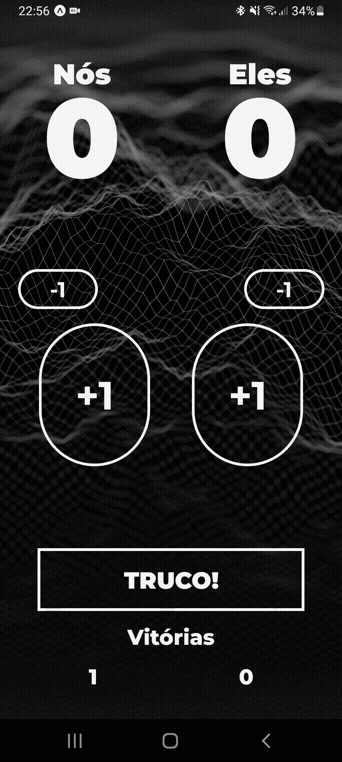

<h1 align="center">Marcador de Truco</h1>

<div align="center" id="top">
  
</div>

## ☕ Sobre o Projeto

Esse projeto é uma aplicação para marcar os tentos e se divertir com os amigos na hora do truco.

## 🚀 Tecnologias Utilizadas

- Expo
- React Native
- TypeScript
- Styled Components

## 📚 Pré-requisitos

Antes de começar, você vai precisar ter instalado em sua máquina as seguintes ferramentas: Git, Expo e Node.js.

Você também vai precisar instalar no seu celular o aplicativo Expo Go na Google Play ou App Store.
 
## 💾 Instalação

Siga as instruções abaixo:
  ```
  # Clone este repositório
  $ git clone https://github.com/gustavoalvim41/truco-scorer.git

  # Acesse a pasta do projeto no terminal/cmd
  $ cd truco-scorer

  # Instale as dependências
  $ yarn

  # Execute este comando no terminal/cmd para iniciar o projeto
  $ yarn start
  
  # Use o Expo Go para ler o QR Code
  ```
